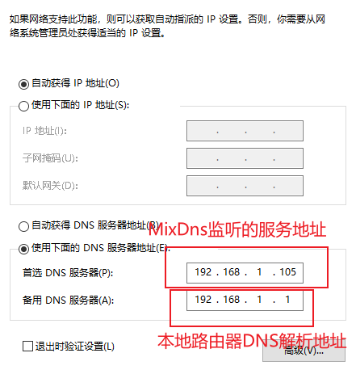
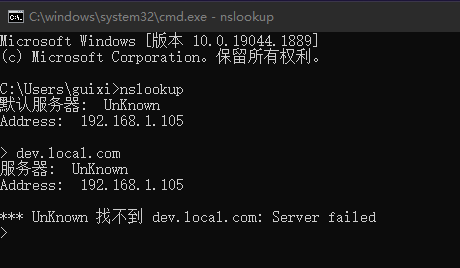
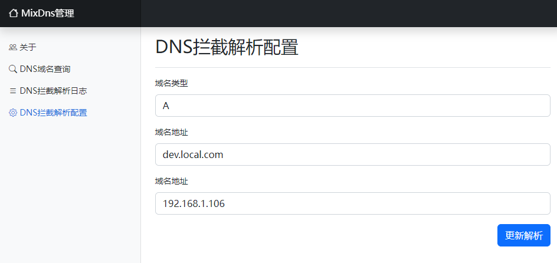
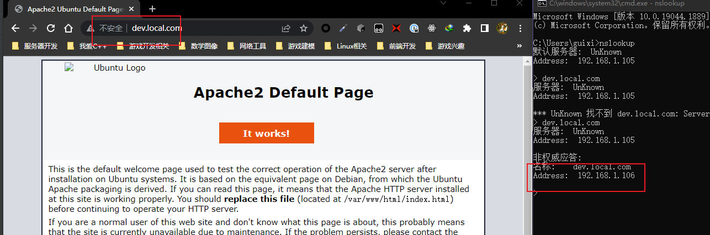

# MixDns解析管理中心

个人和小型的DNS解析管理系统, 用于开发过程之后不需要手动修改 `hosts` 文件将域名指定解析到内网服务器IP.

需要注意以下事项:
* [SpringBoot2](https://spring.io) 作为Web库( 最低基于 **Java11**, 如果降级到Java8可能需要处理兼容性问题)
* [BootstrapV5](https://v5.bootcss.com) 作为前端UI库, 附带采用 `Jquery` 进行处理.
* [Netty](https://netty.io/) 作为DNS网络服务层, 这里采用版本号为 `4.1.77.Final`
* 默认DNS解析服务监听 `53` 端口, 而 Web 管理服务监听 `10053` 端口进行访问
* 项目附带有内置简单的 `Systemd` 系统注册脚本说明, 用于简单编写系统服务
* 默认的现代Linux发行版, 1024以下端口必须采用 `root` 权限才能监听

## 使用方式

只需要配置DNS服务器即可, 第一顺位DNS服务器配置为监听 `MixDns` 服务, 第二顺位则是路由地址提供的DNS服务器:

> `192.168.1.105` 地址就是启动 `MixDns` 内网服务器的IP地址

之后可以配置自定义开发域名解析到内网服务器之中, 这里选择某个不存在域名拦截作为内网开发域名:

`dev.local.com`这个域名没有解析到对应IP, 可以直接用来作为内网开发域名配置, 所以直接在 `MixDns` 直接配置:

之后就能拦截域名到内网服务:

## 其他说明

这里只是初步用来管理个人和小型公司的的内网开发域名指向, 后续可以进行自定修改扩展:
1. 可以扩展比如将地址放置到 `Redis` 缓存管理, 减少向上级域名服务器请求.
2. Web管理简单登录认证, 可以将 `10053` 端口禁用改由 `Nginx` 端口转发, `Nginx` 有简单的认证模块.
3. `MixDns` 重新启动会导致解析记录清空, 这里考虑轻简没有集成数据库做持久化, 但数据持久层在 `service` 已经预留好可以直接定义数据库入库.

